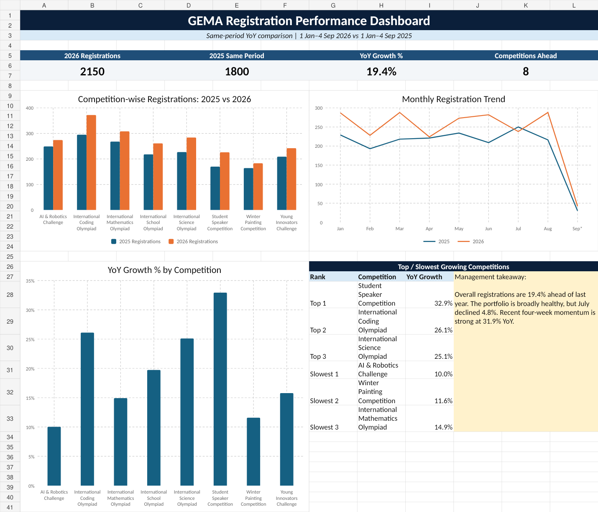

# GEMA Competition Registration Analysis

## Project Overview
This project analyzes GEMA Education competition registrations for 2026 against the same period in 2025. The comparison period is **1 January to 4 September** in both years so that performance is measured on a like-for-like basis.

The objective is to clean the registration data, compare year-over-year performance, identify trends and unusual changes, and present the results in a management-friendly Excel dashboard.

## Key Results
- 2025 same-period registrations: **1,800**
- 2026 registrations: **2,150**
- Overall YoY growth: **+19.4%**
- Competitions ahead of last year: **8 of 8**
- Fastest-growing competition: **Student Speaker Competition (+32.9%)**
- Second-fastest: **International Coding Olympiad (+26.1%)**
- Third-fastest: **International Science Olympiad (+25.1%)**
- July was the only month below the 2025 pace: **-4.8%**
- The latest four-week period was **+31.9% YoY**

## Dashboard

## Analysis Included
The Excel workbook contains:
- Dashboard
- Cleaned Data
- Competition Analysis
- Monthly Trend
- Weekly Trend
- School Analysis
- Cleaning Log
- Management Summary

## Data Cleaning
Major cleaning steps included:
- Removal of duplicate registration IDs
- Removal of obvious test/invalid records
- Standardization of competition names
- Standardization of school-name variants
- Handling of missing school, city, and registration-source values
- Standardization of mixed date formats
- Correction of obvious city-country inconsistencies using a documented mapping
- Preservation of the original country field for auditability

## Files
- `GEMA_Excel_Assignment_GitHub.xlsx` — complete analysis workbook and dashboard
- `GEMA_Cleaned_Dataset_GitHub.xlsx` — cleaned dataset used for analysis
- `MANAGEMENT_SUMMARY.md` — concise business findings and recommendations
- `DATA_CLEANING_NOTES.md` — cleaning methodology and assumptions
- `dashboard-preview.png` — dashboard screenshot for quick GitHub viewing

## Privacy Note
The public GitHub versions are de-identified. Student names and original registration IDs have been replaced with anonymous labels. The original source files should not be uploaded to a public repository.

## Tools Used
- Microsoft Excel
- Excel formulas and charts
- Data cleaning and year-over-year analysis

## Author
Aditya Yadav
